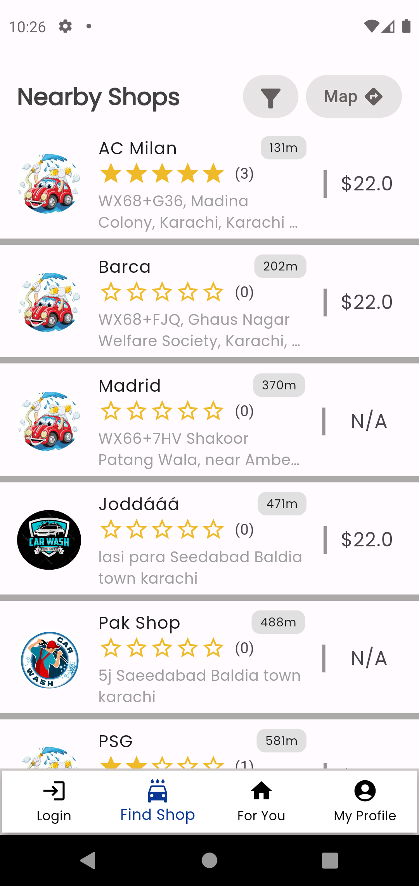
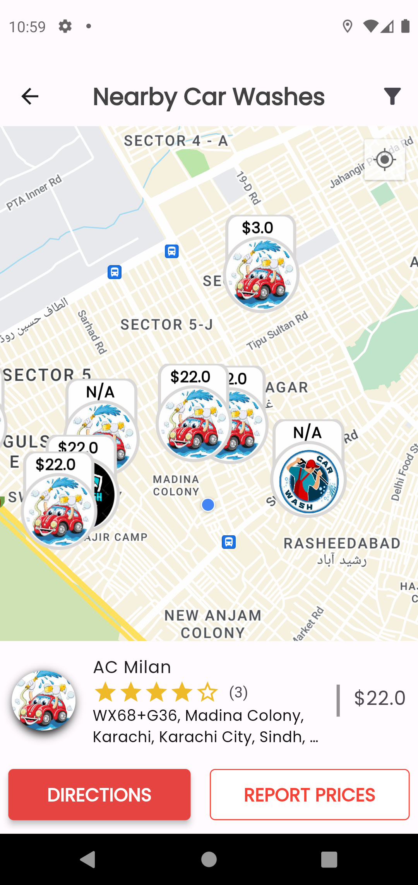
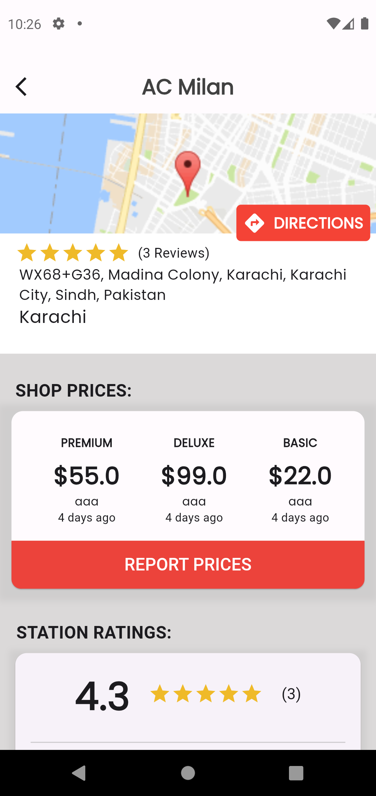
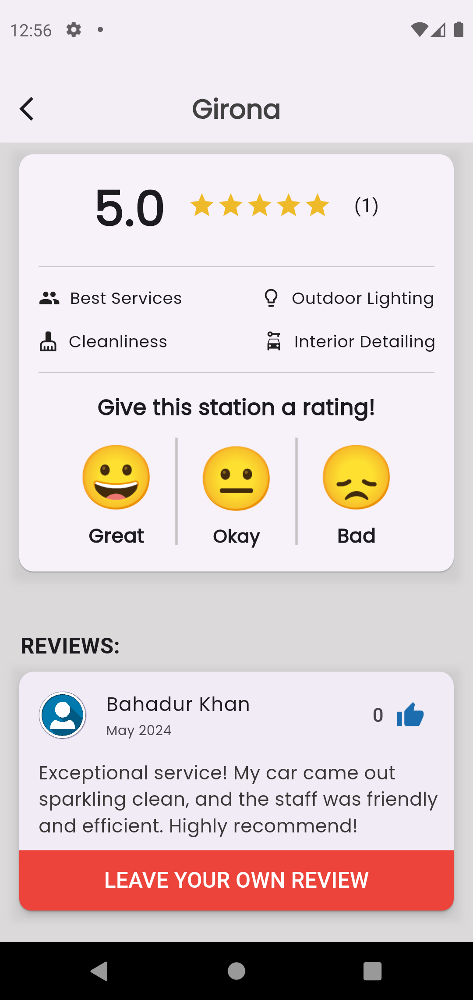
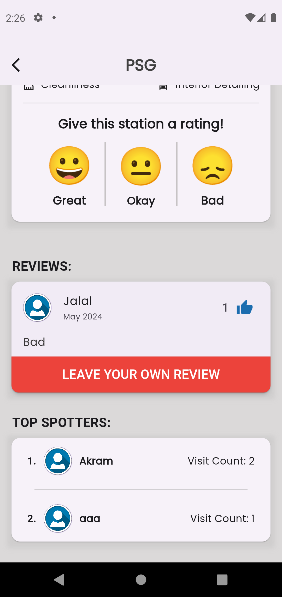
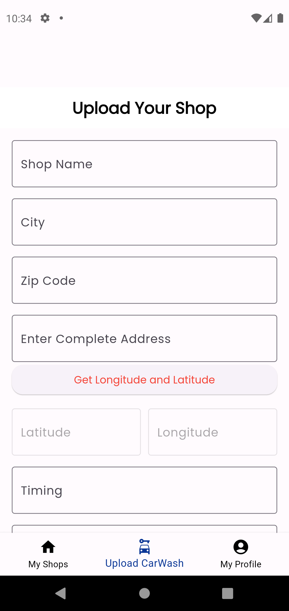
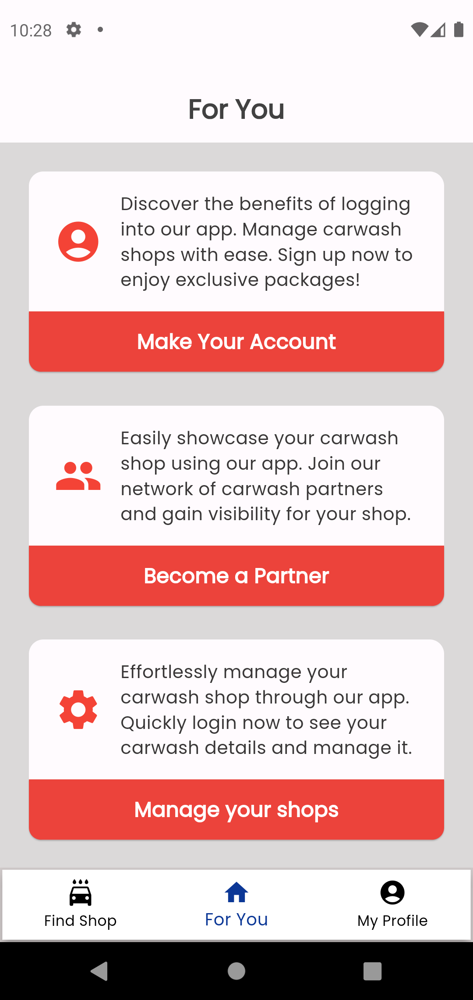
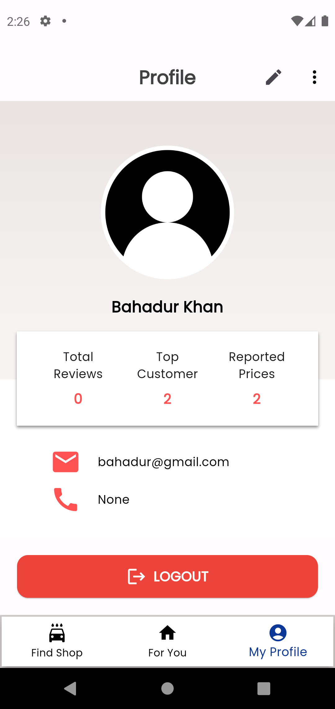

  

# 🚘 Carwash Buddy (Flutter Application)

Developed a Flutter-based app to help users find nearby car washes with real-time user-reported pricing and operational status. Features include map/general views, navigation, and a dedicated web and in-app view for car wash owners to manage listings and updates.  

Tech stack: **Flutter**, **NextJS**, **NodeJS**, **ExpressJS**, **MongoDB**, **AWS**, **Google Maps**, and **Firebase (Google & Facebook auth).**

Implemented **geohashing** to efficiently store and query latitude/longitude coordinates, enabling fast and accurate **nearby search functionality.**

---

### 📸 Screenshots

#### 🏠 Home Page + 🗺️ Map View  
Nearby shops and their locations on a map, based on the user’s current coordinates.

  
  

#### 📄 Detail Pages 
Reported Prices + Reviews and Ratings + Top Spotter/Visitor

  
  
  

---

#### 🧑‍🔧 Carwash Owner Panel (In-App)  
**In-app interface for owners to manage their listings.**  

---

#### 🎯 "For You" Page  
**Personalized suggestions for the user.**  

---

#### 👤 Profile Page  

---

### 🚀 Key Highlights

- Location-based filtering using geohashing
- Owner and user interfaces
- Firebase Google & Facebook authentication
- MongoDB geospatial queries for nearby search
- Fully responsive UI in Flutter

---
